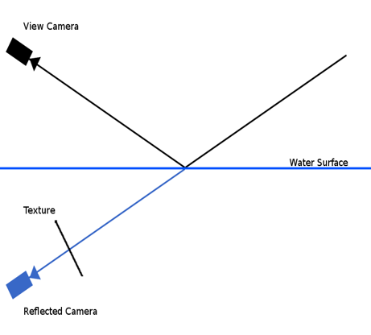
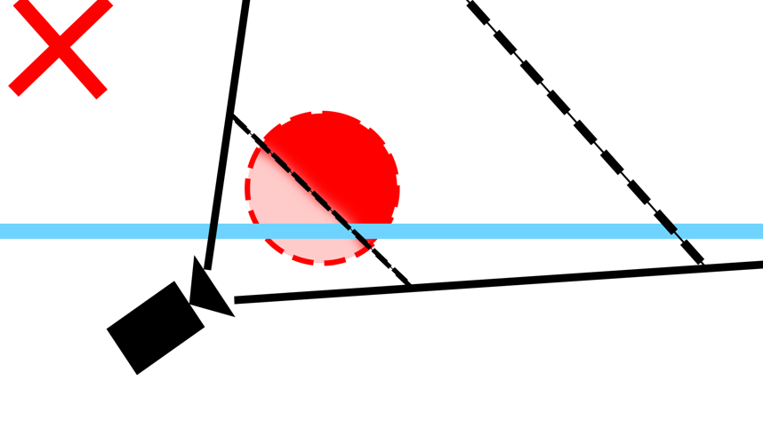
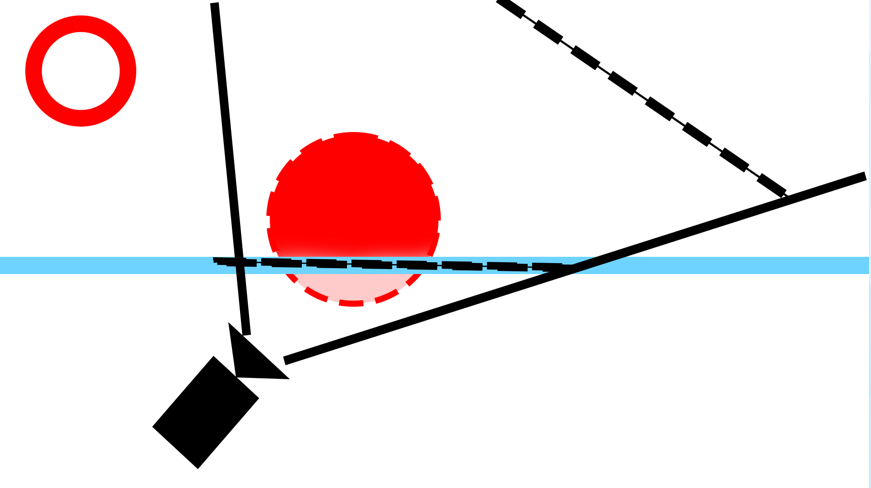
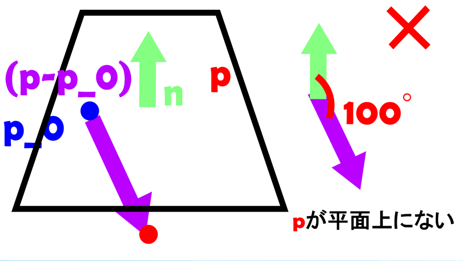
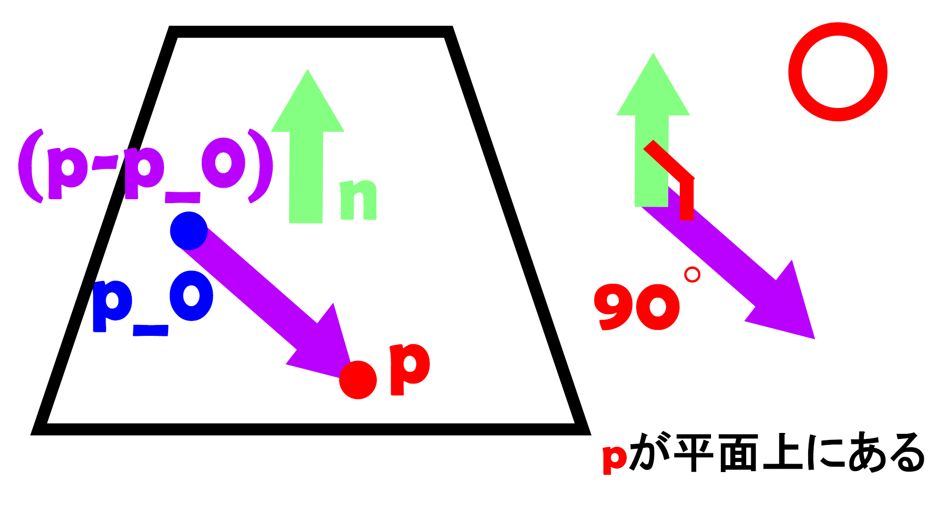

<link rel="stylesheet" href="style.css">

# 「IslandFlight」ポートフォリオ

## 河原電子ビジネス専門学校　ゲームクリエイター科２年
## 氏名：高橋 拓之
- 宛先はこちらです
  -  <a href="mailto:CA01244014@st.kawahara.ac.jp">CA01244014@st.kawahara.ac.jp</a>
## 1.作品概要
- タイトル
  - IslandFlight
- 学校
  - 河原電子ビジネス専門学校
- 制作人数
  - 1人
- 対応ハード
  - PC Windows11
- 使用言語
  - C++
  - HLSL
- 開発環境
  - エンジン
    - 学校内製の簡易エンジン（DirectX12）
  - プログラム
    -  VisualStudio2026
- リンク
  - Youtube <a href="https://www.youtube.com/watch?v=QWX6cZ-uTSc">https://www.youtube.com/watch?v=QWX6cZ-uTSc</a>
  - GitHub <a href="https://github.com/takahasihiroyuki/Island-Flight">https://github.com/takahasihiroyuki/Island-Flight</a>
  - 実行ファイル <a href="https://drive.google.com/drive/folders/1lUoQbhP15KYW21ej1P3BTsVWLprqJtjc?usp=sharing">https://drive.google.com/drive/folders/1lUoQbhP15KYW21ej1P3BTsVWLprqJtjc?usp=sharing</a>
## 2.ゲーム内容
時間内にたくさんコインを集めよう！

## 3.技術紹介
### 3.1 飛行機の物理挙動の実装
##### 本作では、見た目だけでなく「力の関係を説明できる飛行挙動」を目標に、翼単位の物理モデルを実装しました。
#### 3.1.1 飛行機の挙動の実装アプローチ

今回の作品では、飛行機という題材を
単なる数値操作として扱うのではなく、
どのような力の関係によって挙動が生まれているのかを
自分の中でしっかり理解したいと考えました。

そのため、揚力・抗力・モーメントを用いた
物理モデルを採用しています。

単に見た目をそれらしくするのではなく、
「どの力が、どのように影響して今の挙動が生まれているのか」
を自分の中で説明できる状態を目指して実装を行いました。

#### 3.1.2  翼を単位とした物理モデル
本作では、機体全体に一つの力を与えるのではなく、右主翼・左主翼・水平尾翼・垂直尾翼といった各翼が、
それぞれ独立して力を発生させています。  
翼ごとに果たす役割（回転）は異なりますが、
本作では力の計算に用いる基本的な処理は共通としており、
各翼は同一のクラスのインスタンスとして実装しています。  
この構成により、翼を追加する場合も、
翼のインスタンスを一つ追加するだけで対応できます。

#### 3.1.3 力の計算
  
実際に機体に作用する各力をどのように計算しているかについて説明します。  
基本的に力はすべて三次元のベクトルとして扱っています。
考慮している力は、
重力、推力（プロペラによる前進力）、
揚力（翼を上方向に押し上げる力）、
抗力（進行方向と逆向きに作用する力）の四つです。  
揚力と抗力はそれぞれの翼で計算し、四つの翼の力を合成しています。  
そこに推力と重力を加えることで、
機体全体に作用する合力を求めています。

#### 3.1.4 移動の計算
ひとつ前で計算した力をもとに、機体の位置を更新します。
流れとしては、力 → 加速度 → 速度 → 位置の流れです。  
まず、力から加速度に変換します。具体的には、力を質量で割っています。
（力は加速度と比例関係で今の実装では質量はほとんど意味を持っていないですが、機体重量の違いなどをパラメーターとして考慮したい時が来るかもしれないので念のため割り算しています）

そのフレームの速度を求めるために、そのフレームの加速度（つまり加速度×1フレームの時間）を毎フレーム蓄積させます。つまり積分です。  
さらに速度を積分し、次のポジションを求めています。
これを毎フレーム繰り返します。

#### 3.1.5 回転の計算
続いて、機体の回転の計算について説明します。
本作では、各翼で計算したモーメントを合成し、
機体全体に作用するモーメントを求めています。
##### モーメントについて

  

回転の計算を行う前に、
本作で用いているモーメントについて簡単に説明します。

モーメントは三次元のベクトルで、
ベクトルの大きさは回転の強さを、
向きは回転軸の向きを表します。

本作では、
機体の重心から力の作用点へのベクトルと、
その力との外積を用いてモーメントを計算しています。

##### 角速度と姿勢の更新
移動の計算と同様に、
まずモーメントから角加速度を計算し、
角加速度を積分することで角速度を求めます。
さらに、この角速度を積分することで、
機体の姿勢を毎フレーム更新しています。

#### 3.1.6 デバッグ方法

本作では、
力やモーメントといった物理量を扱っているため、
数値だけを追っていても挙動の原因を把握しにくい場面が多くありました。 
しかも、本作では、
右主翼・左主翼・水平尾翼・垂直尾翼の
四つの翼それぞれで力とモーメントを計算しています。
さらに、モーメントは力の作用位置にも影響を受けるため、
挙動がおかしくなった場合でも、

どの翼が原因なのか

どの力やモーメントが問題なのか

を、
機体の姿勢や数値ログだけから直感的に判断することは困難でした。  
そこで、
本作では物理挙動のデバッグ方法として、
各翼で計算された力やモーメントを、3D空間上に矢印として可視化
する仕組みを実装しました。

このデバッグ表示により、
挙動に違和感がある場合でも、  
「どの翼の」「どの力・モーメントが」  
原因になっているのかを即座に切り分けることができ、
物理挙動の調整や修正を効率的に行えるようになりました。

このように、物理挙動を可視化しながら確認できる環境を用意することで、
実装だけでなく調整や仕様変更にも対応しやすい構成になっています。

#### 3.1.7 この実装の失敗と学び
<!-- @import "[TOC]" {cmd="toc" depthFrom=1 depthTo=6 orderedList=false} -->

<!-- code_chunk_output -->

- [「IslandFlight」ポートフォリオ](#islandflightポートフォリオ)
  - [河原電子ビジネス専門学校　ゲームクリエイター科２年](#河原電子ビジネス専門学校ゲームクリエイター科２年)
  - [氏名：高橋 拓之](#氏名高橋-拓之)
  - [1.作品概要](#1作品概要)
  - [2.ゲーム内容](#2ゲーム内容)
  - [3.技術紹介](#3技術紹介)
    - [3.1 飛行機の物理挙動の実装](#31-飛行機の物理挙動の実装)
        - [本作では、見た目だけでなく「力の関係を説明できる飛行挙動」を目標に、翼単位の物理モデルを実装しました。](#本作では見た目だけでなく力の関係を説明できる飛行挙動を目標に翼単位の物理モデルを実装しました)
      - [3.1.1 飛行機の挙動の実装アプローチ](#311-飛行機の挙動の実装アプローチ)
      - [3.1.2  翼を単位とした物理モデル](#312--翼を単位とした物理モデル)
      - [3.1.3 力の計算](#313-力の計算)
      - [3.1.4 移動の計算](#314-移動の計算)
      - [3.1.5 回転の計算](#315-回転の計算)
        - [モーメントについて](#モーメントについて)
        - [角速度と姿勢の更新](#角速度と姿勢の更新)
      - [3.1.6 デバッグ方法](#316-デバッグ方法)
      - [3.1.7 この実装の失敗と学び](#317-この実装の失敗と学び)
    - [3.2 海の描画実装](#32-海の描画実装)
      - [3.2.1 実装の全体構成](#321-実装の全体構成)
      - [3.2.2 描画時の問題](#322-描画時の問題)
      - [3.2.3 描画時の問題の解決策](#323-描画時の問題の解決策)
      - [3.2.4 平面の空間変換と逆転置行列](#324-平面の空間変換と逆転置行列)
    - [3.3 インスタンシング描画](#33-インスタンシング描画)
    - [3.4 FOGとDOF](#34-fogとdof)
    - [FOGとDOFなし](#fogとdofなし)
    - [FOGあり](#fogあり)
    - [DOFあり](#dofあり)
  - [4.工夫した点](#4工夫した点)
    - [4.1 コインのアルゴリズム](#41-コインのアルゴリズム)
    - [4.2 ばねカメラの実装](#42-ばねカメラの実装)
      - [普通のカメラ](#普通のカメラ)
      - [ばねカメラ](#ばねカメラ)
  - [5.コードについて](#5コードについて)
    - [5.1 設計方針とシングルトンの扱い](#51-設計方針とシングルトンの扱い)
    - [5.2 Strategyパターン（UI設計）](#52-strategyパターンui設計)

<!-- /code_chunk_output -->

当初は、物理的な正確さによって
見た目のリアリティも大きく向上すると想定していました。  
しかし実装を進める中で、
物理的な正確さと視覚的な変化は必ずしも比例せず、
見た目の変化に対して調整やデバッグの負担が大きくなる場面も多いことが分かりました。  
本作ではその経験を通じて、
「どこを物理として扱い、どこを割り切るか」
という設計判断の重要性を学びました。

### 3.2 海の描画実装
#### 3.2.1 実装の全体構成
海の反射は、以下の流れで実装しています。  
- 反射用カメラの作成  
- メインカメラを海面で鏡映した位置・向きに変換  
- 反射用カメラでシーンを描画し、レンダーテクスチャに出力  
- そのテクスチャを海モデルに貼り付けて描画
- 法線マップによるUV歪みとスクロールで波を表現

この構成により、
視点や機体の移動に応じて自然に変化する水面反射を実現しています。

#### 3.2.2 描画時の問題
反射用カメラを単純に鏡映した場合、
- 本来映らないはずの水面下のオブジェクトが反射に映る
- 逆に、映したいオブジェクトがクリップされる  

という描画になってしまいます。 

  
  
  

これは図のように近クリップ面が海面と一致しないため起こっています。

#### 3.2.3 描画時の問題の解決策

そこで、近クリップ面は使わず、シェーダー側で海面より下にあるかどうかを判定して描画を止める方法をとりました。

  
  

まず、海面を 1 枚の平面 として考えます。
（海面であるため、無限に続く平面として扱います。）
この平面より下にあるかどうかを判定する方法を考えます。
平面より 上側か下側か を判定するために、
平面が持つ 法線ベクトル を利用します。
もし判定している点が海面上にある場合、
判定したい点と平面上の任意の点を結ぶベクトルは、
平面の法線ベクトルと 90 度 の角度になります。
この性質を利用し、
判定したい点と平面上の点を結ぶベクトルと、
平面の法線ベクトルとの 内積 を計算します。
この内積が 負 になる場合、
点は法線とは逆方向、つまり 平面より下側 にあると判定できます。
本作では、
内積が負になる（海面より下にある）ピクセルは描画しない
という処理を行うことで、
反射描画時に海面下のオブジェクトが映り込まないようにしています。
この判定はワールド空間で定義した平面を基準に行っていますが、
実際にシェーダー内で処理を行う際には、
この平面情報をビュー空間へ変換する必要があります。

#### 3.2.4 平面の空間変換と逆転置行列

本作では海面をワールド空間で定義していますが、
シェーダー内で判定を行うためにはビュー空間へ変換する必要があります。

しかし、平面や法線は「位置」ではなく
内積による条件そのものを表す量です。

今回の判定は

n ・ (P − P₀)

という内積条件で成り立っています。

点のように単純にビュー行列を掛けてしまうと、
この内積関係が変換後の空間で崩れてしまい、
平面方程式の意味が正しく保たれません。

そのため本作では、
平面の法線（および平面係数）を逆転置行列で変換しています。

これは、平面が位置ではなく
内積による条件を表しているためです。
(次の空間へ変換させる行列は基本的に空間内の点を変換するための行列なので、法線や今回のように条件をベクトルにしたものなどを想定している変換ではないのです。なので独自に変換させる行列を考えないといけないのです、そしてこの条件を崩さないように変換する行列を考えると結果的に逆転置行列になるのです。)

通常の行列で変換すると
内積の関係が崩れてしまいますが、
逆転置行列を用いることで
変換前後でも内積の意味を保つことができます。

n' = (ViewMatrix⁻¹)ᵀ n

この変換を用いることで、
回転や平行移動を含む空間変換後でも
内積による上下判定の関係が維持されます。

その結果、ビュー空間でも

n' ・ (P' − P₀')

の条件を用いて、
海面より下かどうかを正しく判定できています。

### 3.3 インスタンシング描画
今回のゲームでは、1000個以上のオブジェクトを描画しています。
さらに海の表現では、反射用にシーンをもう一度描画しているため、そのままだと処理が重くなります。

ただし、使用しているモデルはローポリゴンなので、GPUの描画負荷自体はそこまで高くありませんでした。
そこで原因を調べたところ、ボトルネックはGPUではなく、CPU側で大量のドローコール（Draw呼び出し）をしていることだと分かりました。

この問題に対しては、対策としてインスタンス描画を導入しました。
同じモデルを1個ずつ描画するのではなく、複数個分の情報（行列など）をまとめて送って、1回のDrawでまとめて描画する方式です。
これにより、CPU側の呼び出し回数を抑え、描画処理を軽量化しています。

導入後は、CPU負荷が目に見えて下がり、フレームレートが安定しました。

### 3.4 FOGとDOF

画面全体の見栄えを整えるため、
ポストエフェクトとして FOG（霧表現）と
DOF（被写界深度）を実装しました。

FOG は遠距離のオブジェクトを自然にフェードアウトさせ、
空間の奥行きを出しつつ、画面が煩雑にならないようにしています。

DOF はカメラから遠いオブジェクトをぼかすことで、
画面全体をすっきり見せることを目的としています。

いずれも見た目の印象を優先しつつ、
操作性や視認性を損なわないよう、
効果は控えめに調整しています。
### FOGとDOFなし

### FOGあり

### DOFあり

## 4.工夫した点
### 4.1 コインのアルゴリズム

最初はコインを完全ランダムで出現させていました。
しかし、完全ランダムな配置ではプレイヤーの現在位置に関係なく
遠距離にコインが集中してしまう場合があり、
回収しにくさやプレイテンポの悪さにつながっていました。

そこで、プレイヤーとの距離と向きを考慮し、
近い位置ほど選ばれやすくなるよう出現確率に重みを付けた
重み付き抽選を採用しました。

これによりランダム性は保ちつつも、
自然に回収しやすい位置にコインが配置されやすくなり、
回収テンポの安定化とプレイ感の改善につながりました。

### 4.2 ばねカメラの実装

飛行機に対してカメラをそのまま追従させると、動きが軽く見えてしまうという課題がありました。
そこで、カメラの追従をばねの物理モデルとして実装しました。
その結果、視覚的にも機体の重量感やスピード感を表現できています。
#### 普通のカメラ

#### ばねカメラ

## 5.コードについて
### 5.1 設計方針とシングルトンの扱い

本作では、設計において
「どこからでも触れる便利さ」よりも
「依存関係が明確であること」を優先しました。
そのため、基本方針として
必要な参照は明示的に渡す構成を採用しています。
クラス同士が暗黙に依存しないようにし、
処理の流れが追いやすい状態を意識しました。
一方で、すべてを厳密に分離するのではなく、
全体共有が自然であるものに限ってシングルトンを採用しています。
具体的には、UIManager をシングルトンとして実装しました。
UIはタイトル、プレイ中、リザルトなど、複数の状態から共通して呼ばれます。
また「現在表示中のUI状態」を一元管理したいという理由から、
管理窓口を一つにまとめる方が構造的に整理しやすいと判断しました。

一方で、スコア管理や物理処理、ゲーム進行などは
シングルトンにせず、所有関係を明確にしています。

これにより、どこが生成し、どこが保持し
どこで更新されているか
を追いやすくなり、
デバッグや仕様変更への対応もしやすい構成になっています。
本作を通して、
便利さだけで設計を決めないこと
役割と影響範囲を見て採用を判断すること
の重要性を学びました。

### 5.2 Strategyパターン（UI設計）
本作のUIは、Strategyパターンを用いて設計しています。
UIは画面単位ではなく、
タイマーやコイン表示などの機能単位で構成しています。
複数のUIを同時に表示できる構造です。
UIManagerは更新・描画・表示制御といった共通の流れのみを管理し、
各UIが自身の処理を実装する構造にしています。
UIManagerはUIの具体的な内容を知らず、共通インターフェースを通して処理を呼び出します。
過去の制作ではUI同士の依存が強く、
一部の修正が他のUIに影響することがありました。
その反省から、本作では振る舞いを分離する設計を採用しました。
この構造により、
UI追加時の影響範囲を抑えつつ、
機能単位で独立した実装ができるようになっています。